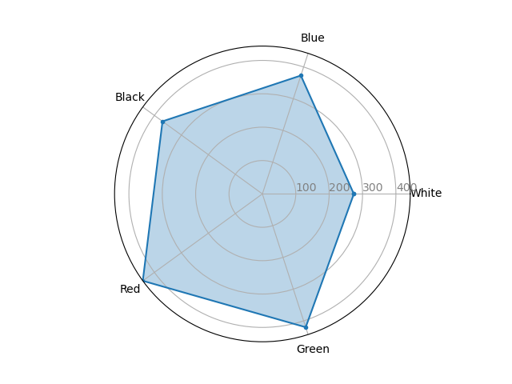
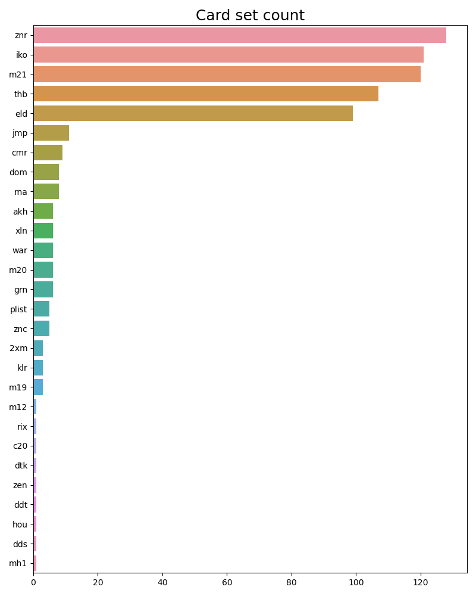
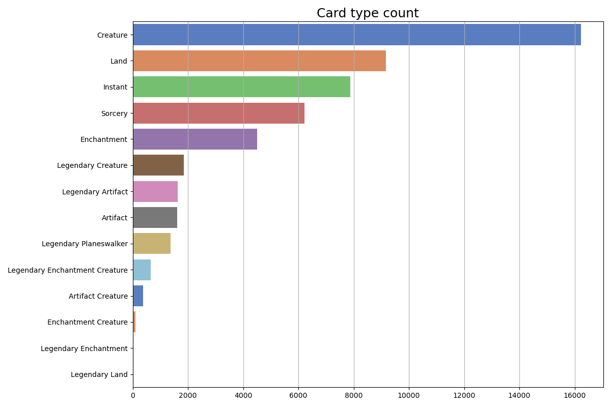
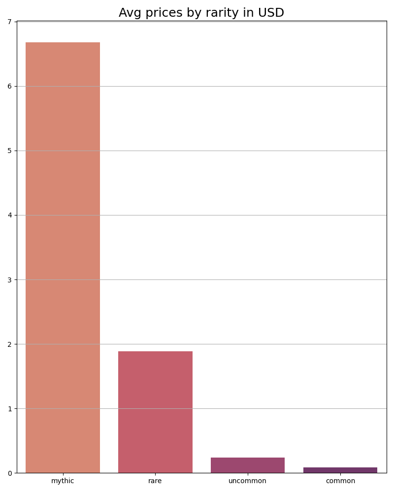
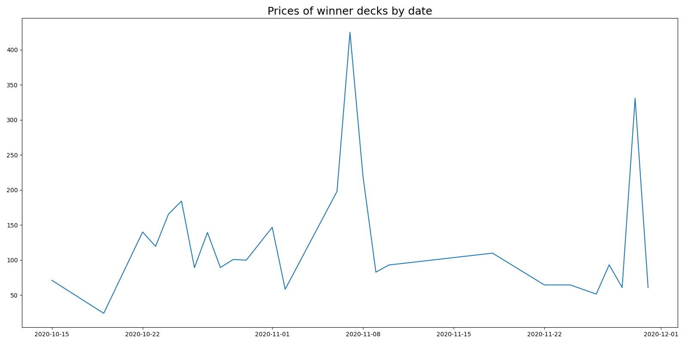
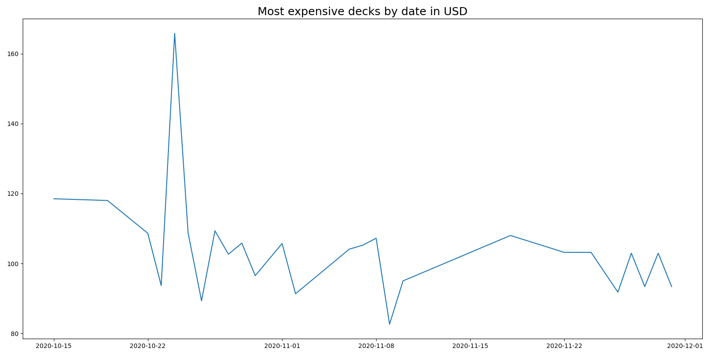

# :deciduous_tree::fire::skull::droplet::sunny: MTG decklist scrapper :sunny::droplet::skull::fire::deciduous_tree:
 A Magic the Gathering deck scrapper for the [magic](magic.gg) and [mtgmelee](mtgmelee.com) websites using the [scryfall API](https://scryfall.com/docs/api).
 
 Project structure was created with [this ETL blueprint](https://github.com/aguiarandre/etl-pipelines).
 
## :floppy_disk: Data
### :leftwards_arrow_with_hook: Extraction
Data is scraped from the websites using Selenium with headless Chrome and stored in the data/raw folder as it is, tagging it by site and tournament.
### :arrows_counterclockwise: Transform
Normalize the data into json files at data/processed with the same format and add data retrieved from the scryfall API (prices, image, etc.).
### :arrow_heading_up: Load
Load each deck and card from the json files into the postgreSQL database.
## :bar_chart: Visualization
Expose the decks conforming the metagame in the given time range and its variables, grouped by categories.

# Presentation

