# :deciduous_tree::fire::skull::droplet::sunny: MTG decklist scrapper :sunny::droplet::skull::fire::deciduous_tree:
 A Magic the Gathering deck scrapper for the [magic](magic.gg) and [mtgmelee](mtgmelee.com) websites using the [scryfall API](https://scryfall.com/docs/api).
 
 Project structure was created with [this ETL blueprint](https://github.com/aguiarandre/etl-pipelines).
 
## :floppy_disk: Data
### :leftwards_arrow_with_hook: Extraction
Data is scraped from the websites using Selenium with headless Chrome and stored in the data/raw folder as it is, tagging it by site and tournament.
### :arrows_counterclockwise: Transform
Normalize the data into json files at data/processed with the same format and add data retrieved from the scryfall API (prices, image, etc.).
### :arrow_heading_up: Load
Load each deck and card from the json files into the postgreSQL database.
## :bar_chart: Visualization
Expose statistics of the given decks and its card attributes

# Analysis
The goal of this project is to analyze the common factors among the top winner decks in different tournaments with more than 64 players registered. Card properties like type, set, colors, prices, mana cost and others are the ones provided by the Scryfall API.

*:warning: Limitation note: currently the prices are obtained at the moment of the data extraction, not the date of the tournament.*

## Metagame
First, let's take a dive in the current metagame (october-november 2020)

### Color distribution

|  |
|:--:|
| *Color count among decks* |

As most players know, the green color has been being pushed by the design team of Wizards of the Coast for quite some time in Standard format now, and in second place the red color makes an appearance, maybe together in the same decks?

:bulb: *Red and green decks are popular.*

| 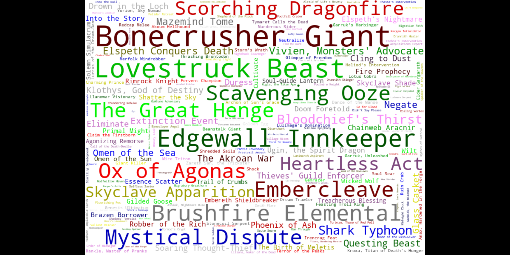 |
|:--:|
| *Card frequency in all the registered tournaments* |

| 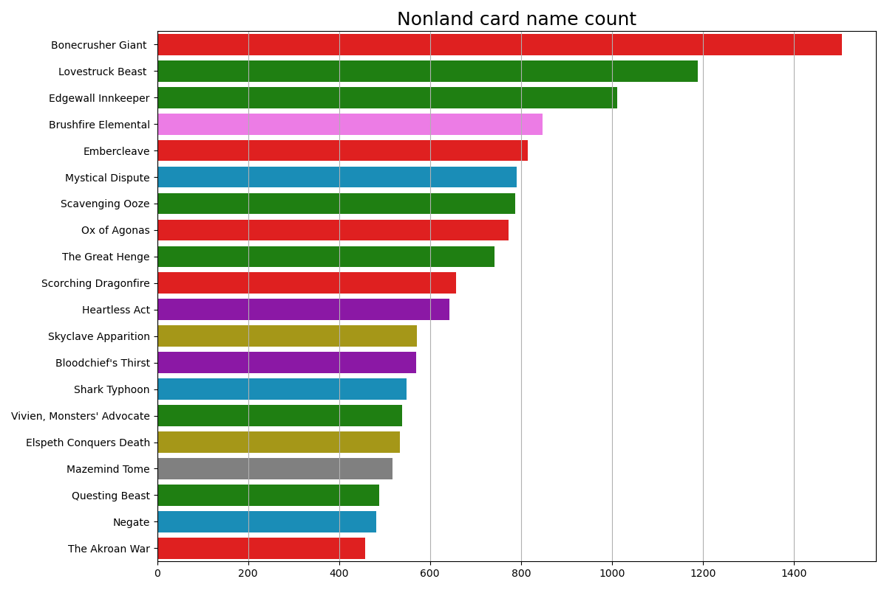 |
|:--:|
| *Card frequency in all the registered tournaments* |

The most popular card is the red [Bonecrusher Giant](https://scryfall.com/card/eld/115/bonecrusher-giant-stomp) with 2292 appearances in 51523 total cards in decks, followed by [Lovestruck Beast](https://scryfall.com/card/eld/165/lovestruck-beast-hearts-desire) and [Edgewall Inkeeper](https://scryfall.com/card/eld/151/edgewall-innkeeper), both green cards with 1950 and 1642 appearances. In a fourth place comes the red-green [Brushfire Elemental](https://scryfall.com/card/znr/221/brushfire-elemental) with 1399 and [Ox of Agonas](https://scryfall.com/card/thb/147/ox-of-agonas#) closing the top 5 with 1264.

:bulb: This top 5 is already the **16.5%** of the total cards.

### Type distribution
| 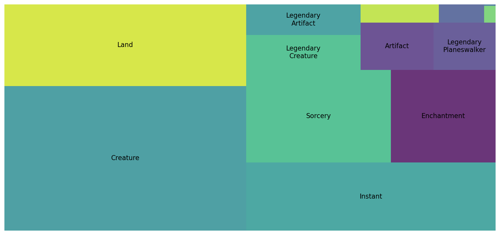 | 
|:--:|
| *Card types count in all tournaments* |

|  |
|:--:|
| *Card types count in all tournaments* |

From 51523 cards registered in tournaments, 22678 were creatures, 13109 nonbasic lands, 10263 instants, 8322 sorceries and 6295 enchantments, with other types below the 2500 each.

:bulb: *This gives a clear picture that agresive decks are abundant.*

### Converted Mana Cost Distribution
Most spells have a converted mana cost (an integer representing how much mana the spell costs), and in order for a player to interact in time in the game with 
their opponent, they need to have a "mana curve" fitting the metagame, that is a proper distribution of the mana costs of their spells:
| 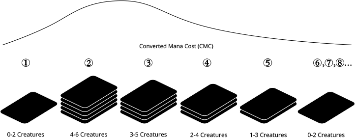 | 
|:--:|
| *Magic mana curve example filtered by creatures only* |

There is no use of building a deck with powerful cards if you cant play the before turn 5 while your opponent outraces you with cheap creatures.
| 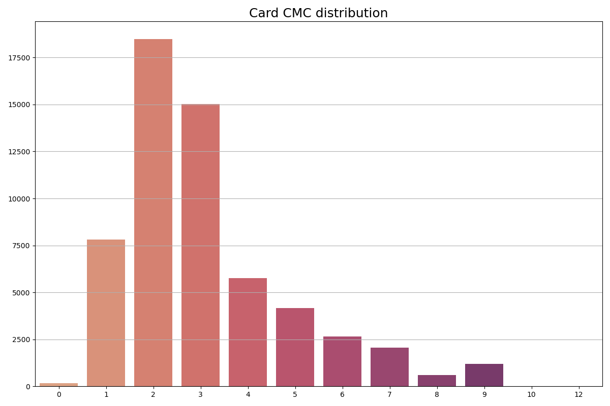 |
|:--:|
| *Converted mana cost distribution* |

### Set distribution
| 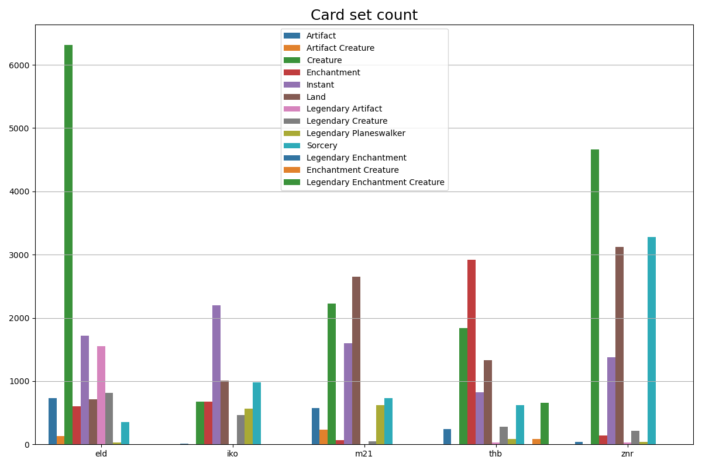 | 
|:--:|
| *Card types count for each set in all tournaments* |

Aggregating by expansion set we can see how much each set apports to each card type in the current metagame. Throne of Eldraine (ELD) and Zendikar Rising (ZNR) contributed with the most number of creatures, favoring aggro decks. Also, the more type-focused sets Theros Beyond Death (THB) and again Zendikar Rising (ZNR) add Enchantments and Lands. On the other hand, the sets with less card count in the metagame like M21 and Ikoria (IKR) add instants with more frequency than the other sets.
### Rarity distribution
As MTG cards have different chances of coming up in a booster pack - of the fifteen playing cards included, one is a basic land, ten are common, three are uncommon, and one is rare (76%) or mythic rare (24%) - mythic and rares tend to be more valuable because of their availability, specially if their mechanics are useful in-game.

|  | 
|:--:|
| *Card rarity count and price in all tournaments* |

:bulb: *The rare cards are the most played and the mythics are the most expensive in average.*
## Winner decks
So, what of all the attributes of the cards showed before have relation with the finishing position of a deck in a tournament? Let's start by checking the correlation of the position of the deck with all the other variables. Because the lower position is better, the lower the value, the more they correlate.
| 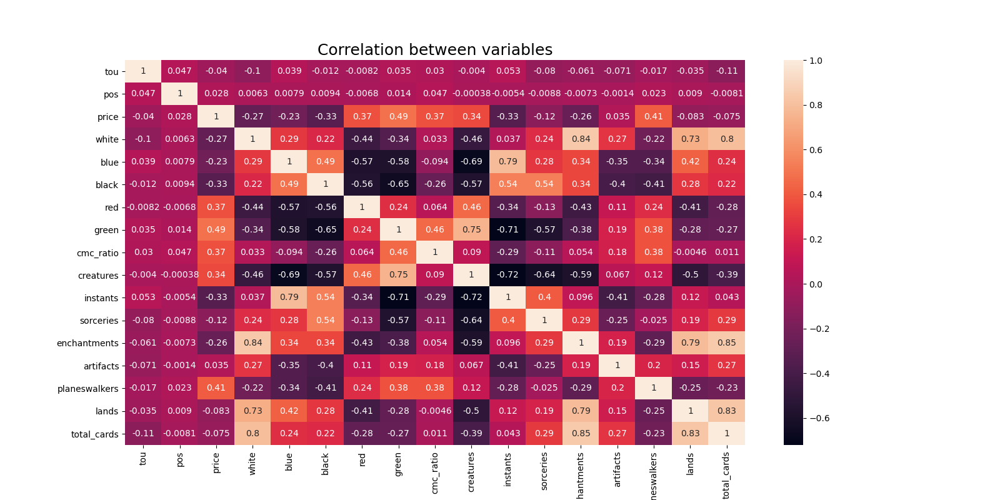 | 
|:--:|
| *Correlation between variables* |

### Color
| 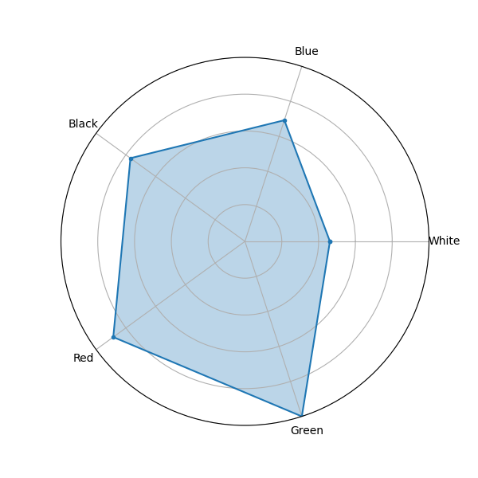 |  | 
|:--:|:--:|
| *1st place deck colors* | *Average deck colors by tournament* |

The colors that tend to appear more among first place decks are blue and black, compared to the average. White appears in the same proportions in winner decks and average decks.

### Type
| 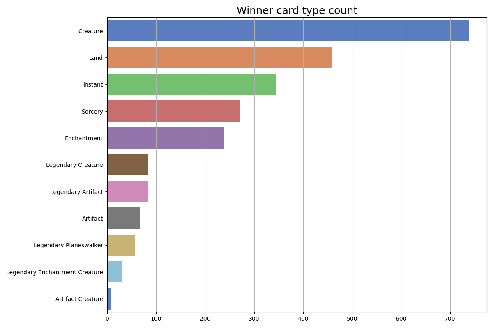 |
|:--:|
| *1st place card types* |

### Set
| 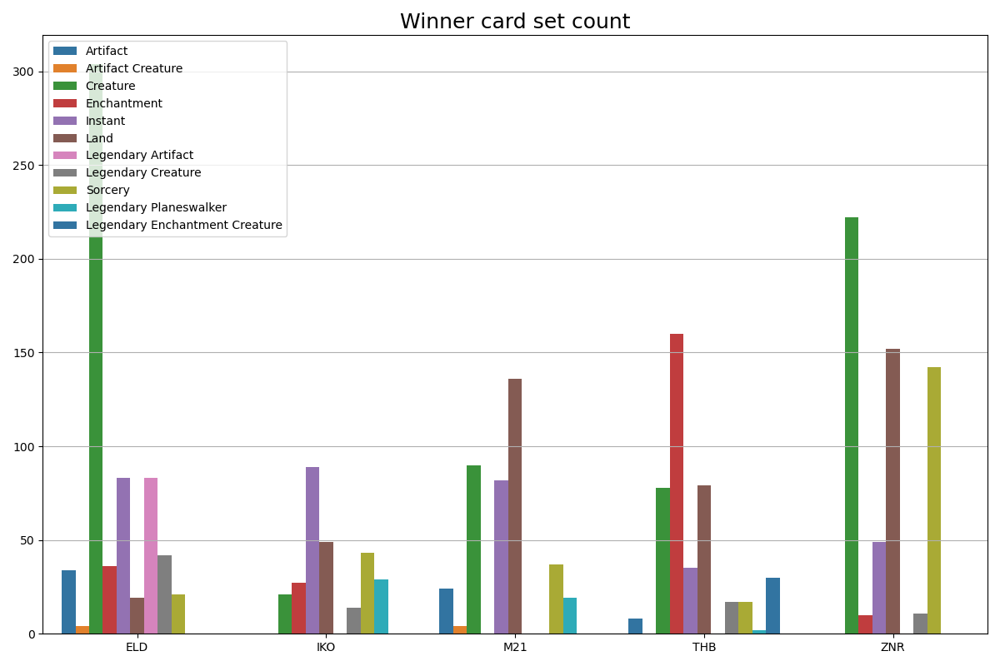 |
|:--:|
| *1st place card types* |

### CMC
| 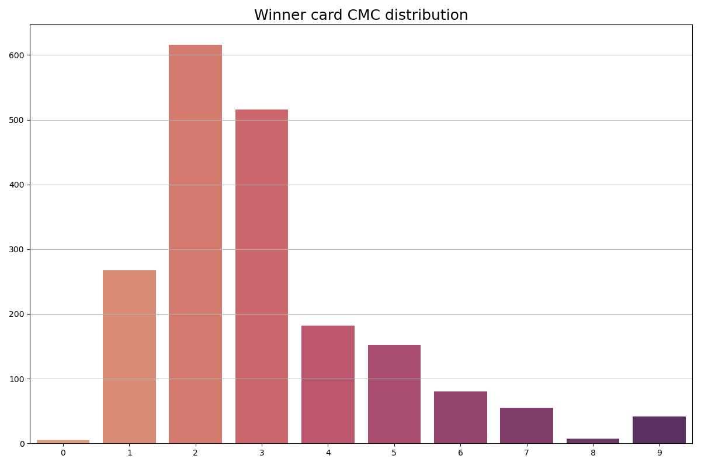 |
|:--:|
| *1st place CMC* |

### Price
|  | 
|:--:|
| *Average deck prices by tournament* |
There is a very slight inclination for the winning decks to be more expensive.

